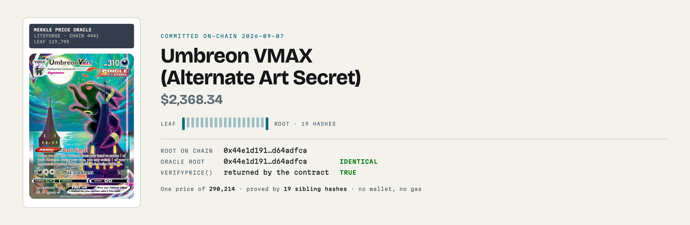
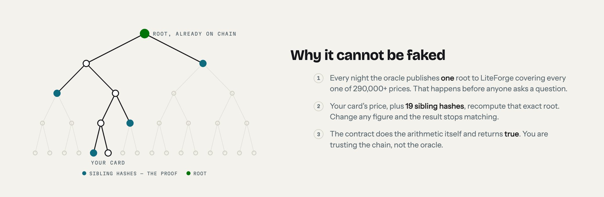
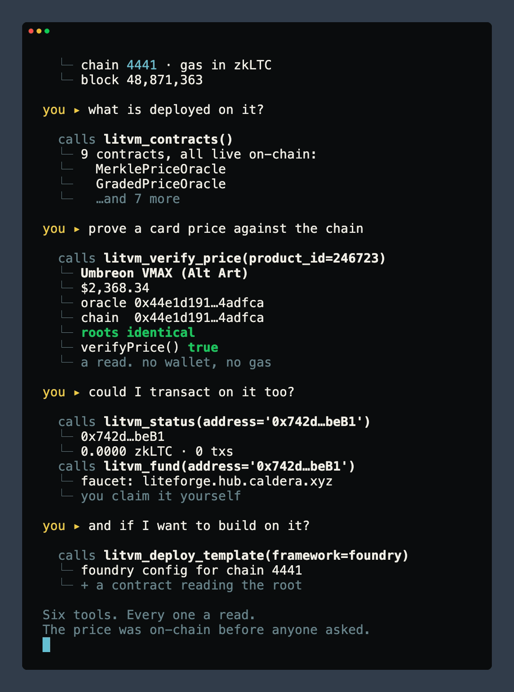

<div align="center">

# LitVM Agent Onboarding

**Get an agent onto LitecoinVM — and show it something worth doing there.**

[](https://modelcontextprotocol.io) [](https://docs.litvm.com) [](#the-six-tools) [](#it-cannot-touch-your-wallet) [](#connect) [](LICENSE.md)

```
https://onboard.the-undesirables.com/mcp
```

[](https://insiders.vscode.dev/redirect/mcp/install?name=litvm-onboard&config=%7B%22type%22%3A%22http%22%2C%22url%22%3A%22https%3A%2F%2Fonboard.the-undesirables.com%2Fmcp%22%7D) [](https://cursor.com/en/install-mcp?name=litvm-onboard&config=eyJ1cmwiOiJodHRwczovL29uYm9hcmQudGhlLXVuZGVzaXJhYmxlcy5jb20vbWNwIn0=)

<picture>
  <source media="(prefers-color-scheme: dark)" srcset="assets/hero-dark.png">
  <source media="(prefers-color-scheme: light)" srcset="assets/hero-light.png">
  
</picture>

<sub>Real values, read from the chain at build time. Rebuild with <code>python tools/build_hero.py</code>.</sub>

</div>

---

## Why this exists

LitVM documents how a **person** adds the network to a wallet and claims test tokens. Nothing
tells an **agent** what the chain is, what runs on it, or what to do first.

This fills that gap, and it leads with the answer to *why bother*: there is a real price oracle
deployed on LiteForge, and an agent can prove one of its prices against the chain in a single
call, for free, in about a second.

## It cannot touch your wallet

All six tools are reads. This server holds no key, signs nothing, sends nothing, and there is
no code path in it that could move an asset. Two tools accept an address so they can look up a
public balance — the same thing any block explorer does — and that is the extent of it.

**You do not need a wallet at all** to use the part that matters.

## What you can ask for

| You say | The agent calls | What comes back | Wallet? |
|---|---|---|---|
| "What is LitVM and how do I connect?" | `litvm_network` | Chain 4441, RPC, explorer, live block, gas token, wallet-config JSON | no |
| "What's deployed on it?" | `litvm_contracts` | Nine contracts, each checked live for bytecode | no |
| "Prove me a card price against the chain" | `litvm_verify_price` | The proof, both roots side by side, and the contract's own `true` | **no** |
| "I want to build on the oracle" | `litvm_deploy_template` | Foundry / Hardhat / Remix config + a contract that reads the root | no |
| "Am I set up to transact?" | `litvm_status` | Public balance and transaction count for an address you name | reads one |
| "How do I get test tokens?" | `litvm_fund` | The faucet link and the click path, for you to follow yourself | reads one |

The last two matter only if you want to **write** to the chain, which costs gas. Reading prices
never does.

## What that proof actually says

**It proves** the price was committed on-chain before you asked, so nobody changed it
after the fact. **It does not prove** the price is right. One oracle publishes it.

<div align="center">
<picture>
  <source media="(prefers-color-scheme: dark)" srcset="assets/proof-dark.png">
  <source media="(prefers-color-scheme: light)" srcset="assets/proof-light.png">
  
</picture>
</div>

The root in the picture above is a snapshot and it is stale by design. A new one is
committed to LiteForge every night, so the value changes daily. The durable claim is not
"the root is `0x44e1…`" — it is that **the oracle's root and the chain's root always
agree**, and the contract will confirm it while you watch. Run `litvm_verify_price()` for
today's, or open the
[live JSON](https://oracle.the-undesirables.com/api/v1/merkle/proof?product_id=246723)
and compare it to
[`merkleRoot()` on the explorer](https://liteforge.explorer.caldera.xyz/address/0x20A812309AD14aa39B59aE2791972dfe8dDDe80E?tab=read_contract).

Every card comes back with its art and its own
[page](https://oracle.the-undesirables.com/card/246723), so an agent can show a person
what it just verified instead of only telling them.

## What a session looks like

<div align="center">

</div>

Six questions, six tools, one connector and no keys. Every line is a live call against
`onboard.the-undesirables.com`. Regenerate it with `vhs demo.tape`; the script it records
is [demo.py](demo.py).

## Three slash commands

Clients that support MCP prompts surface these as commands:

| Command | Does |
|---|---|
| `verify_a_card(card_name)` | Proves one card's price and explains what the result does and does not mean |
| `get_started_on_litvm(address)` | Walks you onto the chain using a wallet you already control |
| `build_on_litvm(framework)` | Sets up a project and a contract that reads the oracle root |

Every prompt tells the model not to ask you for a private key, not to offer to hold one, and
not to generate a wallet for you.

## The six tools

| Tool | Does |
|---|---|
| `litvm_verify_price(card_name \| product_id)` | Proof, leaf fields, both roots, and a live `verifyPrice()` call. A bare call demos itself. |
| `litvm_network()` | Chain 4441 params, RPC and WebSocket, explorer, faucet, gas token, live block and gas price |
| `litvm_contracts()` | Directory of live LiteForge contracts, each checked for deployed bytecode |
| `litvm_deploy_template(framework)` | Foundry / Hardhat / Remix config for chain 4441 plus a ten-line consumer contract |
| `litvm_status(address)` | Public balance and transaction count, and what to do next |
| `litvm_fund(address)` | Faucet link, steps, and the rate-limit workaround. Cannot claim for you. |

## Connect

**One click:** the VS Code and Cursor buttons above.

**Claude Desktop / Perplexity:** add a custom remote connector with the URL.

**Cursor / Windsurf / VS Code, by hand:**

```json
{ "mcpServers": { "litvm-onboard": { "url": "https://onboard.the-undesirables.com/mcp" } } }
```

**Anything else that speaks MCP:** point it at `https://onboard.the-undesirables.com/mcp`.
Streamable HTTP, no auth headers.

## What it's built on

- **LiteForge**: chain `4441`, RPC `https://liteforge.rpc.caldera.xyz/http`, explorer
  [liteforge.explorer.caldera.xyz](https://liteforge.explorer.caldera.xyz), faucet
  [liteforge.hub.caldera.xyz](https://liteforge.hub.caldera.xyz), gas token zkLTC
  ([docs.litvm.com](https://docs.litvm.com)).
- **The oracle**: [oracle.the-undesirables.com](https://oracle.the-undesirables.com).
  `/api/v1/merkle/proof` returns the proof *and* the five leaf fields `verifyPrice()` takes,
  with a self-check that they hash to the leaf behind today's on-chain root.
- **MerklePriceOracle** on LiteForge:
  [`0x20A812309AD14aa39B59aE2791972dfe8dDDe80E`](https://liteforge.explorer.caldera.xyz/address/0x20A812309AD14aa39B59aE2791972dfe8dDDe80E)
  — one of nine contracts this operator runs on the chain, all listed by `litvm_contracts`.

## Run it yourself

```bash
pip install fastmcp web3 eth-abi httpx
PORT=8413 python server.py     # then point a client at http://127.0.0.1:8413/mcp
```

Or `docker build -t litvm-onboard . && docker run -p 8413:8413 litvm-onboard`.
`python audit.py <url>` runs the full test suite against any instance.

## Honest limits

- **Testnet only.** zkLTC has no monetary value and nothing here is a guarantee about a future
  mainnet.
- **The faucet is browser-only.** No API exists, so `litvm_fund` returns steps for a person to
  follow. It cannot claim on your behalf.
- **Prices come from one oracle** — this one. The proof shows the price was committed on-chain
  before you asked, not that it is the correct price.
- **Only actively-priced products are provable.** Catalog entries with no market price today
  are not in the tree, and asking for one returns a clear error rather than a false negative.

---

Built by [sailorpepe](https://github.com/sailorpepe) / The Undesirables LLC.

Related: [litvm-tcg-oracle-mcp](https://github.com/sailorpepe/litvm-tcg-oracle-mcp) — 16 tools, the
oracle through the LitVM lens · [undesirables-mcp-server](https://github.com/sailorpepe/undesirables-mcp-server)
— the full 27-tool TCG Oracle.
